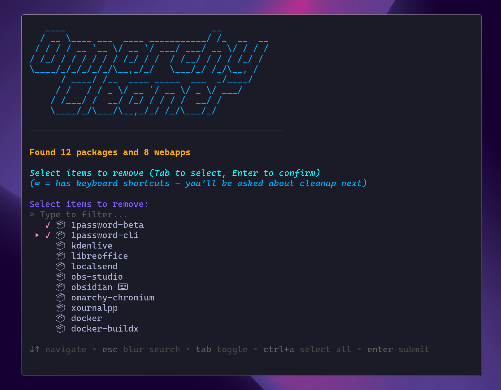
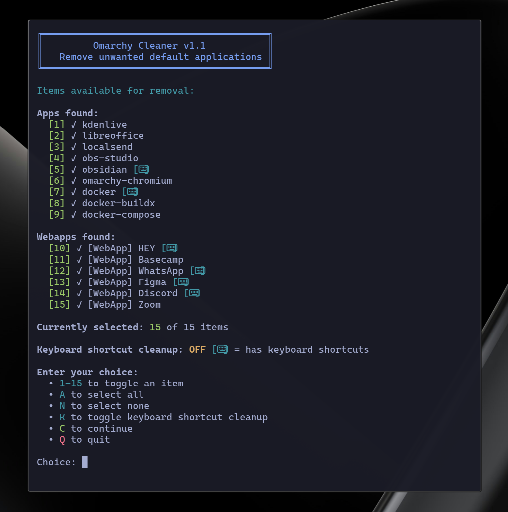
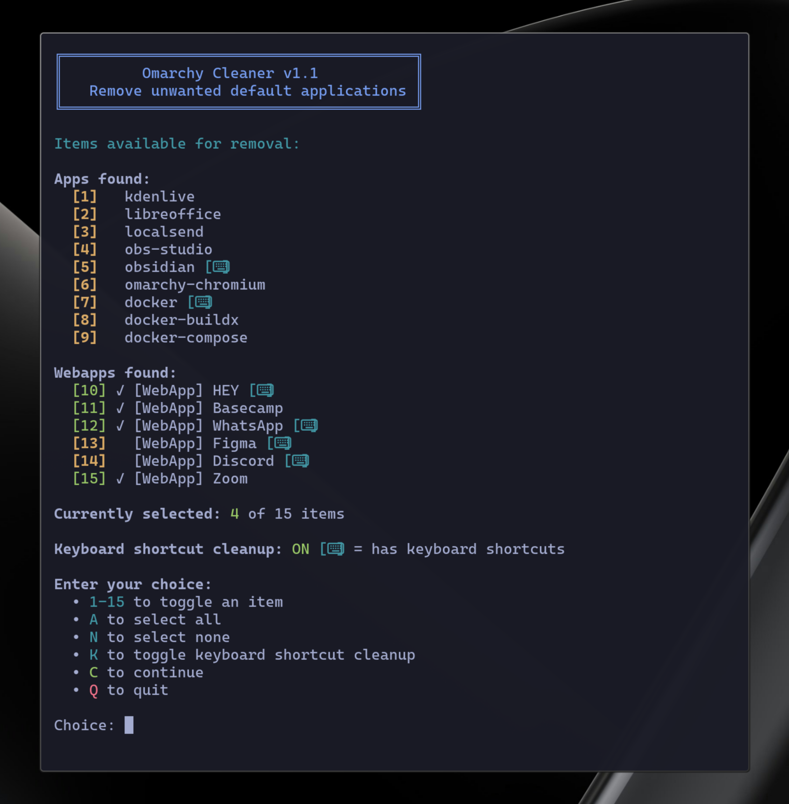
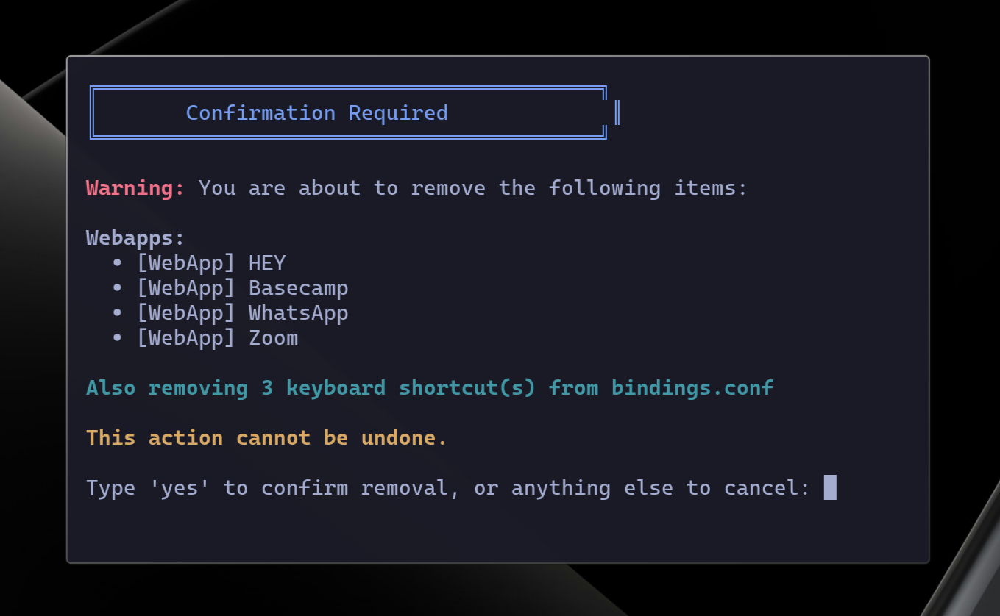
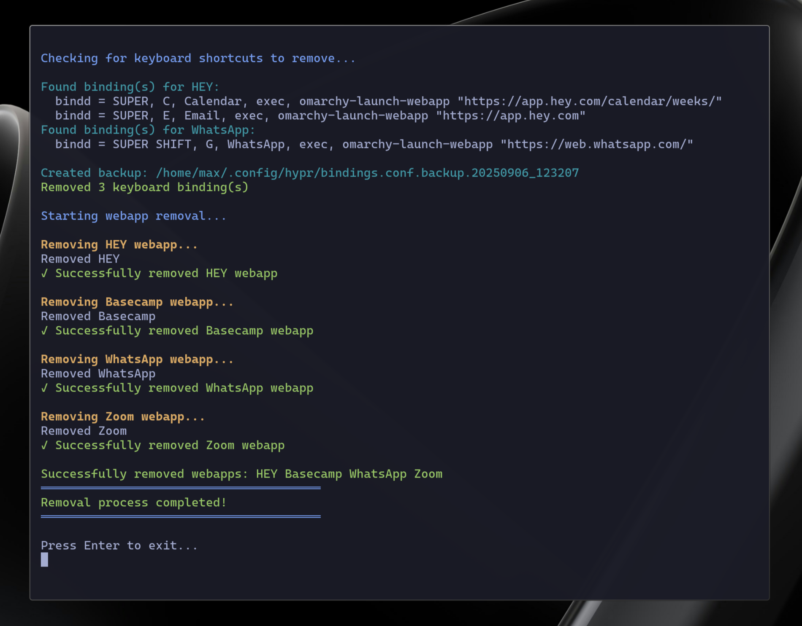

# Omarchy Cleaner

> If Omarchy is the omakase of Linux distros, a curated feast of pre-installed apps and webapps, Omarchy Cleaner is your trusty pair of chopsticks to pluck away the unwanted wasabi for a perfectly tailored system. 🥢

A text-based interactive shell script to remove unwanted default applications and webapps from Omarchy installations.



## Quick Start

Run directly without downloading:

```bash
curl -fsSL https://raw.githubusercontent.com/maxart/omarchy-cleaner/main/omarchy-cleaner.sh | bash
```


## Features

- **Interactive Text Interface**: Clean, colorful text-based UI with item selection
- **Dual Removal**: Removes both regular packages (via pacman) and webapps (via omarchy-webapp-remove)
- **Selective Removal**: Choose which applications and webapps to remove using number keys
- **Keyboard Shortcut Cleanup**: Optionally remove associated keyboard shortcuts from `~/.config/hypr/bindings.conf`
- **Safe Operation**: Multiple confirmation steps before removing packages

## Usage

The script will:
1. Check for installed packages and webapps from its removal lists
2. Present the selection interface where you can:
   - Select which applications and webapps to remove
   - See which items have keyboard shortcuts (⌨)
3. Display both regular apps and webapps with clear icons (📦/🌐)
4. If selected items have keyboard shortcuts, ask if you want to remove them (YES/NO)
5. Ask for final confirmation before removal
6. Optionally remove keyboard shortcuts from `~/.config/hypr/bindings.conf`
7. Request sudo privileges if needed for package removal
8. Remove selected packages and webapps, showing the results

## Customizing the Lists

The script includes comprehensive lists of Omarchy's default packages and webapps. You can customize which items are offered for removal by editing the arrays in the script:

### Regular Applications
```bash
DEFAULT_APPS=(
    # Packages offered for removal
    "1password-beta"
    "1password-cli"
    "kdenlive"
    "libreoffice"
    "localsend"
    "obs-studio"
    "obsidian"
    "omarchy-chromium"
    "signal-desktop"
    "spotify"
    "xournalpp"
    "docker"
    "docker-buildx"
    "docker-compose"
    
    # Additional packages can be uncommented to include them
    # See the full list of Omarchy default packages in the script
)
```

### Webapps
```bash
DEFAULT_WEBAPPS=(
    "HEY"
    "Basecamp"
    "WhatsApp"
    "Google Photos"
    "Google Contacts"
    "Google Messages"
    "ChatGPT"
    "YouTube"
    "GitHub"
    "X"
    "Figma"
    "Discord"
    "Zoom"
)
```

Simply uncomment or comment out items in these lists to customize what the cleaner offers to remove. The script contains the full list of all Omarchy default packages (100+ items), with only commonly unwanted applications active by default.

## Keyboard Shortcut Cleanup

The script can automatically detect and remove keyboard shortcuts associated with the apps and webapps you're removing. This feature:

- Scans `~/.config/hypr/bindings.conf` for matching keyboard bindings
- Shows a ⌨ indicator next to items that have associated shortcuts during selection
- After app selection, presents a YES/NO dialog for items with keyboard shortcuts
- Shows exactly which items have shortcuts before asking for confirmation
- Creates a timestamped backup of your bindings.conf before making changes
- Intelligently matches bindings for:
  - Regular applications (e.g., `uwsm app -- spotify`)
  - Terminal applications (e.g., `$terminal -e btop`)
  - Webapps (e.g., `omarchy-launch-webapp "https://chatgpt.com"`)

The matching is case-insensitive and handles various command formats used in Omarchy's bindings configuration.

## App Screenshots

<details>
<summary>View</summary>






</details>


## Default Omarchy packages and webapps
You can find the default Omarchy package list [here](https://github.com/basecamp/omarchy/blob/master/install/packages.sh) and the default webapps [here](https://github.com/basecamp/omarchy/blob/master/install/packaging/webapps.sh).


## License

Omarchy Cleaner is released under the [MIT License](https://opensource.org/licenses/MIT).