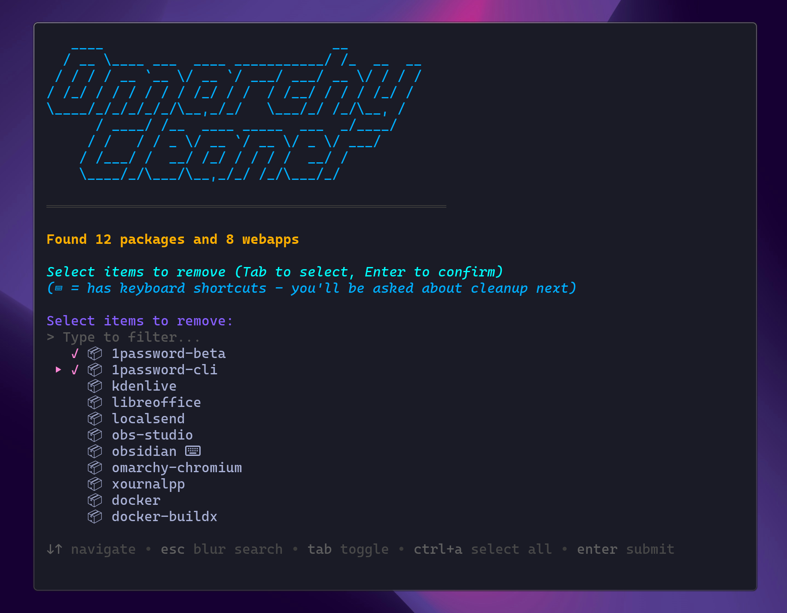

# Omarchy Cleaner

> If Omarchy is the omakase of Linux distros, a curated feast of pre-installed apps and webapps, Omarchy Cleaner is your trusty pair of chopsticks to pluck away the unwanted wasabi for a perfectly tailored system. 🥢

An interactive shell script to remove unwanted default applications and webapps from Omarchy installations with a clean, visual interface.



## Quick Start

```bash
curl -fsSL https://raw.githubusercontent.com/maxart/omarchy-cleaner/main/omarchy-cleaner.sh | bash
```

## How It Works

The script scans your system for Omarchy's default **packages**, **webapps**, and **npm CLI tools**, presents them in an interactive fuzzy-select interface, and safely removes your choices. Unlike Omarchy's own all-or-nothing `omarchy-remove-preinstalls`, you pick exactly what to remove. It can also surgically clean up the associated Hyprland keyboard shortcuts — removing only the keybinds for the items you removed (with a backup), supporting both the current `bindings.lua` and the legacy `bindings.conf` formats — and provides visual feedback on completion status.

## Customization

Edit the `DEFAULT_APPS`, `DEFAULT_WEBAPPS`, and `DEFAULT_NPM_CLIS` arrays in the script to customize which items are offered for removal. The script includes comprehensive lists from Omarchy's default installation, with commonly unwanted applications enabled by default and the rest available as commented entries you can uncomment.


## Default Omarchy packages and webapps
You can find the default Omarchy package list [here](https://github.com/basecamp/omarchy/blob/master/install/omarchy-base.packages) and the default webapps [here](https://github.com/basecamp/omarchy/blob/master/install/packaging/webapps.sh).

## License

 Omarchy Cleaner is released under the [MIT License](https://opensource.org/licenses/MIT).